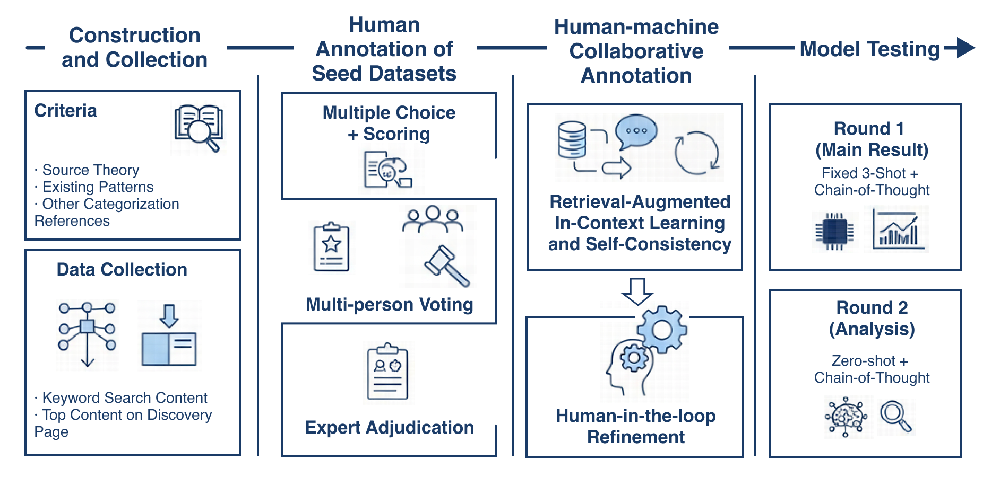

# Dataset Construction
## The Overall Construction Process
Figure 3 illustrates the systematic workflow employed to build the PsyHookBench dataset, covering stages from raw data collection to final expert verification. It offers a visual roadmap of our methodology to ensure the reproducibility and quality of the annotation process.

  
  
<b>Figure 3: Systematic workflow for building the PsyHookBench dataset.</b>

## Performance Different Annotators
To ensure the reliability of the dataset and filter out potential malicious annotations, we calculated the mean, variance, and standard deviation of the scores assigned by five individual human annotators. This statistical oversight ensures that each annotator's output remains within a reasonable and consistent range. You can see the result in Table 1.

### Table 1: Performance statistics for different annotators

| Statistic | Ann. 1 | Ann. 2 | Ann. 3 | Ann. 4 | Ann. 5 |
| :--- | :---: | :---: | :---: | :---: | :---: |
| **Mean** | 0.8571 | 0.2710 | 0.4368 | 0.5816 | 0.4354 |
| **Variance** | 1.3946 | 0.6114 | 0.8050 | 1.2292 | 0.8870 |
| **Std. Dev.** | 1.1809 | 0.7819 | 0.8972 | 1.1087 | 0.9418 |

## Annotation Platform Interface
Our specialized annotation platform provides a structured environment for the annotators. The interface, as illustrated in Figure 2, displays comprehensive image-text content, operational definitions, scoring criteria, and intuitive selection boxes to facilitate precise labeling.

  
  
<b>Figure 2: Annotation platform GUI.</b>

## Dataset Composition and Construction Details
Table 2 provides a detailed breakdown of the number of psychological hooks identified per sample, distinguishing between single-hook, composite-hook (including the specific distribution of multiple labels), and no-hook instances. This granular view supplements the general dataset statistics by highlighting the co-occurrence frequency of different psychological mechanisms. Table 3 illustrates the distribution of data across various social media content categories.

### Table 2: Number of psychological hooks for each sample

| Statistic | Number |
| :--- | :--- |
| **1 Hook** | 1339 (44.03%) |
| **Composite Hook** | **Total: 837**   2 hooks: 626 (74.79%)   3 hooks: 179 (21.39%)   4 hooks: 27 (3.22%)   5 hooks: 4 (0.47%)   6 hooks: 1 (0.1%) |
| **No Hook** | 865 (28.6%) |

### Table 3: Content source categories

| Category | Count | Percentage |
| :--- | :--- | :--- |
| **Keywords search** | 81 | 2.66% |
| **Recommend** | 364 | 11.97% |
| **Fashion** | 236 | 7.76% |
| **Food** | 308 | 10.13% |
| **Cosmetic** | 223 | 7.33% |
| **Movie and TV** | 259 | 8.85% |
| **Career** | 273 | 8.98% |
| **Love** | 307 | 10.10% |
| **Household** | 229 | 7.53% |
| **Gaming** | 253 | 8.32% |
| **Travel** | 269 | 8.85% |
| **Fitness** | 239 | 7.86% |

Table 4 provides a multifaceted overview of the dataset scale, including the distribution of image and video modalities, alongside linguistic and engagement metrics such as title lengths and like counts. To further characterize the psychological landscape of our data, Table 5 enumerates the occurrences of the eight predefined hook categories and their respective annotation quality levels, distinguishing between high-consensus samples and complex edge cases. Together, these statistics offer a granular foundation for understanding the data diversity and labeling rigor underlying our research.

### Table 4: Dataset Statistics

| Statistic Category | Metric | Value |
| :--- | :--- | :--- |
| **Overview** | Total Count | 3041 |
| | Image Count | 1233 (40.55%) |
| | Video Count | 1808 (59.45%) |
| **Title & Likes** | Maximum Title Length | 36 |
| | Average Title Length | 15.05 |
| | Maximum Like Count | 313,000 |
| | Average Like Count | 7,248.79 |
### Table 5: 8 Psychological Hooks Counts & Quality

| Hook Category | Count |
| :--- | :--- |
| **Gain Appeal** | 1153 |
| **Information-gap** | 658 |
| **Perceptual Contrast** | 589 |
| **Ingroup Identification / Outgroup Distinction** | 402 |
| **Anomaly and novelty** | 226 |
| **Social Comparison** | 102 |
| **Authority Endorsement** | 69 |
| **Fear Of Missing Out (FOMO)** | 42 |
| --- | --- |
| **Only High Consensus** | 1620 |
| **High Consensus and Edge Cases** | 341 |
| **Only Edge Cases** | 215 |

## Inter-Annotator Agreement Analysis
As Table 6 shows, we also computed Gwet's AC1 to assess inter-annotator agreement. 

At a finer granularity, we observed substantial AC1 variance across different hooks. This highlights the difference between hooks with salient, easily identifiable cues and those that require stronger intention sensing and cognitive inference. In particular, two hooks with AC1 below $0.6$---*Information gap* ($0.07$) and *Ingroup Identification / Outgroup Distinction* ($0.42$)---appear more distinctive in social media contexts. Their annotation relies not only on observable cues but also on higher-level inference, and they are more susceptible to platform noise and subjective factors (e.g., over-generalization and audience background; see Appendix for details). Therefore, our pipeline of **thresholding, voting and expert rechecking for edge cases** is necessary and reasonable.

Moreover, the high agreement for *FOMO*, *Social Comparison*, and *Authority Endorsement* further validates the quality of our annotators. The final agreement results, Macro-AC1 ($0.68$) and Micro-AC1 ($0.72$), are sufficient to support the development of next stage for multimodal tasks involving psychological cognition.

### Table 6: Inter-rater reliability metrics across different hooks
| Hook ID | AC1 | $P_o$ | $P_e$ |
| :--- | :--- | :--- | :--- |
| 1 | 0.975780 | 0.976660 | 0.036337 |
| 2 | 0.790952 | 0.858350 | 0.322406 |
| 3 | 0.074397 | 0.536821 | 0.499592 |
| 4 | 0.754727 | 0.824145 | 0.283023 |
| 5 | 0.637577 | 0.762173 | 0.343785 |
| 6 | 0.426241 | 0.662777 | 0.412256 |
| 7 | 0.902347 | 0.913078 | 0.109891 |
| 8 | 0.916603 | 0.926358 | 0.116967 |
| **Overall** | **Macro-AC1** | **0.684828** | |
| | **Micro-AC1** | **0.720893** | ($P_o=0.8075, P_e=0.3105$) |

In this section, we provide the detailed statistical distribution of the identified psychological hooks within our dataset. Table 7 summarizes the mean ($\mu$), variance ($\sigma^2$), and standard deviation ($\sigma$) for each of the eight predefined hook categories. These indicators characterize the frequency and dispersion of specific hooks across the sampled content, providing a quantitative basis for the complexity analysis discussed in the main text.

### Table 7: Statistical results of various indicators

| Hook ID | Mean ($\mu$) | Variance ($\sigma^2$) | Std. Dev. ($\sigma$) |
| :--- | :---: | :---: | :---: |
| 1 | 0.0544 | 0.0977 | 0.3126 |
| 2 | 0.5088 | 0.2459 | 0.1568 |
| 3 | 1.4000 | 1.8872 | 1.3738 |
| 4 | 0.4576 | 0.8985 | 0.9479 |
| 5 | 0.5791 | 0.7027 | 0.8383 |
| 6 | 0.8290 | 1.2347 | 1.1112 |
| 7 | 0.1569 | 0.2956 | 0.5437 |
| 8 | 0.1451 | 0.3427 | 0.5854 |

## Assessment of Annotation Robustness

**Pre-annotation study.**
We sampled 100 items from the seed set as a validation set and evaluated GPT-4o under different temperatures, different numbers of sampling rounds, and different text--image ratios in the retrieved context. The results show an overall F1 around 0.5 (Macro-F1: 0.5103; Micro-F1: 0.4858; Average Recall: 0.6888; see Table 8. Since 87\% of our labels are zeros (i.e., hook absent), achieving a Macro-F1 of 0.5 in this long-tailed multi-label setting suggests that the model has captured substantial regularities, while remaining weaker on edge cases.

**Comparison with non-expert annotators.**
We further compared the model against the average performance of human annotators before expert arbitration. The human baseline (Macro-F1: 0.5191; Micro-F1: 0.5435) indicates that the proposed strategy allows the model to reach a non-expert human level. This also highlights the complexity of the task and motivates our subsequent expert diversion and rechecking strategy.

### Table 8: Test results of pre-annotation under different conditions
| Metric | title:image=1:1 (5 rounds) | title:image=1:1 (1 round) | title:image=4:1 (1 round) | Human Annotation |
| :--- | :--- | :--- | :--- | :--- |
| Macro-F1 | 0.5103 | 0.4860 | 0.5429 | 0.5191 |
| Micro-F1 | 0.4858 | 0.4816 | 0.5591 | 0.5435 |
| Average Recall | 0.6888 | 0.6830 | 0.7017 | 0.6699 |

**Formal model annotation.**
We ultimately adopted a 5-round labeling configuration with temperature set to 0.5 for each round, together with retrieval from two weighted vector database. For Hook 01, 02, 03, 04, and 06, we used a vector database with a text--image retrieval weight ratio of 4:1. For Hook 05, 07, and 08, we used a vector database with a text--image retrieval weight ratio of 1:1.

**Expert diversion and rechecking strategy.**
Given the difficulty and complexity of the task, we further combined each hook's AC1 values and pre-annotation performance (F1 and recall) to specify, for each hook, which voting outcomes require expert rechecking. We refer to this as a **traffic-light diversion strategy**. Under the *green-light* condition, we accept the machine voting outcome as the final label; under the *red-light* condition, the label must be reviewed by experts.Refer to Table 9 for the detail.

### Table 9: Conditions and core logic for expert diversion and rechecking
| Hook | Feature | Green votes | Red votes | Core logic |
| :--- | :--- | :--- | :--- | :--- |
| **1 FOMO** | low Precision; high Recall; high AC1 | 0, 1, 2 | 3, 4, 5 | The model may randomly output "1"; expert review is triggered for $>50\%$ votes to remove hallucinations. |
| **2 Gain Appeal** | medium AC1; acceptable F1/Precision | 0, 1, 4, 5 | 2, 3 | The model behaves normally; only split votes are sent to expert review. |
| **3 Information-gap** | low AC1; medium F1/Recall | 0, 1, 4, 5 | 2, 3 | Ambiguous boundary cues can mislead the model; expert review targets mid-range votes. |
| **4 Anomaly/Novelty** | low Precision; high Recall; high AC1 | 0, 1, 2 | 3, 4, 5 | Same as Hook 1. |
| **5 Perceptual Contrast** | medium AC1; acceptable F1/Precision | 0, 1, 4, 5 | 2, 3 | Same as Hook 2. |
| **6 Ingroup/Outgroup** | low Recall; high Precision; low AC1 | 0, 4, 5 | 1, 2, 3 | The model tends to avoid uncertain "1" labels and thus misses cues; expert review focuses on mid and low votes. |
| **7 Social Comparison** | high AC1; high F1 | 0, 1, 2, 4, 5 | 3 | The model is reliable; only disputed votes require expert review. |
| **8 Authority** | high AC1; high F1 | 0, 1, 2, 4, 5 | 3 | Same as Hook 7. |
